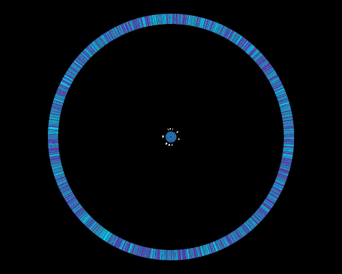
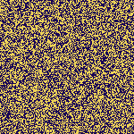
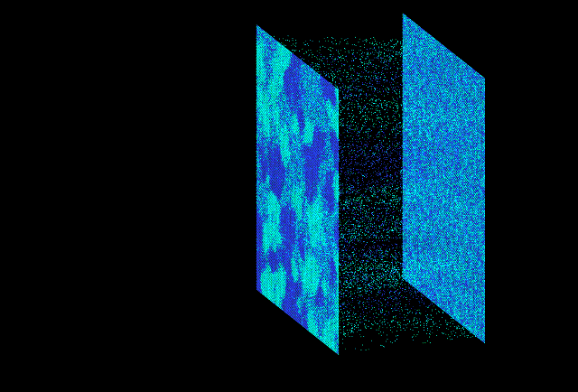

# Schelling Simulations

This repository contains three self-contained browser visualizations of the Schelling segregation model:

| Simulation | Entry point | Visualization |
| --- | --- | --- |
| [Schelling 1D](#schelling-1d-simulation) | `Schel1D/schel1D-js.html` | Agents on a circular sequence |
| [Schelling 2D](#schelling-2d-simulation) | `Schel2D/schel2D-js.html` | Agents on a square grid |
| [Schelling-2d-in-3d](#schelling-2d-in-3d) | `Schel2Din3D/schel2Din3D-js.html` | A 2D grid rendered as a 3D point scene |

Adapted from the older (but faster) [C/OpenGL code](https://github.com/bob7/Schelling-Simulations). 

Phase transitions were shown by G. Barmpalias, R. Elwes and A. Lewis-Pye in:

- [Digital morphogenesis via Schelling segregation.](https://arxiv.org/abs/1302.4014) Nonlinearity (2018) and FOCS (2014)
- [Minority population in 1D Schelling model.](https://arxiv.org/abs/1508.02497) J. Stat. Physics (2018)
- [Unperturbed Schelling Segregation in 2D and 3D.](https://arxiv.org/abs/1504.03809) J. Stat. Physics (2016 )
- [Tipping Points in 1D Schelling Models with Switching Agents.](http://barmpalias.net/papers/tipping.pdf) J. Stat. Physics 2015

---

# Schelling 1D simulation

An interactive visualization of a one-dimensional Schelling segregation model. Two types of agents occupy a circular sequence of positions. Agents that have too few neighbors of their own type exchange places, showing how local preferences can produce larger groups of the same type.

The app is contained in [schel1D-js.html](Schel1D/schel1D-js.html), with its HTML, styles, simulation logic, and export code in one file. It runs in the browser without a build step or backend.

## Running the app

Open `Schel1D/schel1D-js.html` in a modern browser. An internet connection is needed to load the Chroma.js color library from its CDN. The initial view is a preview; pressing **start** creates a fresh random population and color pair and begins the simulation.

## Controls

The panel is arranged as **[start] [reset] [tune] [svg] [gif] [rules]**. Button widths stay fixed as labels change.

| Button | Action |
| --- | --- |
| **start** | Begin a new simulation. The button becomes **pause**. |
| **pause** | Pause the current run without losing its population or history. The button becomes **resume**. |
| **resume** | Continue the same run. The button becomes **pause** again. |
| **reset** | Stop and restore the current run’s initial population and colors. Clear transitions and GIF history, disable GIF export, and return the main button to **start**. |
| **tune** | Open the parameter sliders. Click outside the panel to close it. Changes apply when a new simulation starts, not when a paused run resumes. |
| **svg** | Download the current visualization as a vector SVG, including the rings and transition history. Available before and after starting. |
| **gif** | Download an animated GIF of the current run from its initial state through the export point. Enabled after **start** is pressed. |
| **rules** | Show the model explanation. Click outside the popup to close it. |

After the simulation finishes, the main button returns to **start**. Starting again replaces the previous run and its GIF history. Use **reset** to return to the initial state at any time. Pressing **start** after resetting runs that same initial population again; random swap choices can produce a different history. If you change the parameters before starting, the app creates a fresh population using those settings.

Keyboard shortcuts: **g** starts or resumes; **q** pauses. Opening the tune or rules panel does not pause the simulation.

## Parameters

| Parameter | Default | Range | Meaning |
| --- | --- | --- | --- |
| Size | 4,000 | 1,000–20,000 | Number of agents and positions on the circle. |
| Radius | 50 | 1–100 | Number of positions considered on each side of an agent. |
| Tolerance | 0.4 | 0–1 | Minimum same-type proportion required for an agent to be happy. |
| Minority | 0.5 | 0–1 | Probability that each initial agent belongs to the first type. The actual proportion varies randomly. Values above 0.5 make that type the majority. |

The two types are named red and blue internally, but each run uses a randomly selected contrasting color pair.

## How transitions work

1. **Initialize the circle.** Each position independently receives one of the two agent types according to the Minority setting. The number of agents of each type remains constant during the run.
2. **Evaluate happiness.** The program counts the types within each local neighborhood, wrapping around the ends of the sequence. It maintains separate lists of unhappy agents of each type.
3. **Select a pair.** One unhappy agent of each type is chosen randomly. For tolerance at or below 0.5, this pair can swap directly. Above 0.5, an additional selection rule rejects pairs within the neighborhood radius of each other, including across the circular boundary, and pairs whose neighborhood biases fail the implemented comparison `bias[first] <= bias[second] + 2`.
4. **Swap positions.** The two agents exchange places. This counts as one transition (one swap), and the program records the new color at both positions along with the transition number.
5. **Update nearby agents.** Neighborhood counts and unhappy lists are updated around the two changed positions. The next pair is selected from those updated lists.
6. **Repeat or stop.** The run stops when either type has no unhappy agents left, or when the circle contains exactly two boundaries between types, meaning each type occupies one contiguous group. Stopping does not necessarily mean every agent is happy: there may simply be no unhappy opposite-type partner available.

The implementation includes the agent itself in its happiness calculation, using a neighborhood of `2 × radius + 1` positions. An agent is happy when its same-type count divided by that neighborhood size is at least the tolerance. The in-app rules currently describe a neighborhood excluding the agent; the calculation described here reflects the actual code.

One swap is attempted per animation callback, and the visualization normally redraws every five swaps. Pausing, exporting, and reaching the stopping condition also redraw the current state. The speed therefore depends on the browser and the amount of history being rendered.

## Reading the visualization

- **Small inner ring:** the initial population, preserved throughout the run.
- **White marks near the inner ring:** agents that were unhappy initially; these marks do not track current happiness.
- **Large outer ring:** the current population. Each angular position represents the same location in the circular sequence.
- **Colored dots between the rings:** the history of swaps. Each swap adds two dots at the affected angular positions, colored by the type occupying each position after the swap.

History progresses outward: early transitions lie near the center and recent transitions lie near the outer ring. A dot's radius is calculated as `40 + 290 × transitionIndex / (currentTransitionCount + 1)`. As the run grows, earlier dots move inward because the entire history is rescaled. These dots are a record of position changes, not paths traced by individual agents.

---

# Schelling 2D simulation

A browser-based visualization of a two-type Schelling segregation model. Agents occupy a square grid and exchange positions according to local preferences, allowing you to watch clusters develop from a random initial arrangement.

## Run the app

Open `Schel2D/schel2D-js.html` in a modern browser. No build step or backend is required. The page loads Chroma.js from a CDN for color generation, so an internet connection is needed for that dependency, particularly when resetting or changing parameters.

`Schel2D/example.html` is a separate 1D simulation used as the visual reference for the tune panel and toolbar highlights.

## Controls

| Control | Action |
| --- | --- |
| **start / pause / resume** | Start the simulation, pause it, or continue the current run. Displays **finished** when the stopping condition is reached. |
| **reset** | Generate a new random grid and update its colors using the current parameters. Clear the recorded animation. |
| **rules** | Open the in-app explanation. Click outside the popup to close it. |
| **tune** | Open the parameter panel. Click outside the panel to close it. |
| **svg** | Download the current grid as a vector image. |
| **gif** | Download the recorded stages as a looping animation. Available after starting a run. |

The `g` key also starts, pauses, or resumes the simulation; `q` reloads the page.

### Parameters

| Parameter | Default | Range | Meaning |
| --- | --- | --- | --- |
| **Size** | 150 | 50–250 | Grid side length, `N`. The grid contains `N × N` agents; the default is 22,500 agents. |
| **Radius** | 4 | 1–10 | Neighborhood radius, `w`, in both grid directions. |
| **Tolerance** | 0.45 | 0–1, step 0.01 | Minimum fraction of the neighborhood that must have the agent's own type for it to be happy. |

Changing any slider immediately resets the simulation and clears its recording. Press **start** to run the new configuration.

## Transition process

### Initial state and neighborhoods

Every cell contains one agent, represented internally as `+1` or `-1`. Each initial type is chosen independently with probability 0.5, so the two population sizes are approximately equal. The display colors can change on reset; the code calls the types red and blue regardless of their displayed colors.

The grid wraps across both edges, forming a torus. Each agent's neighborhood is a square of side `2w + 1`, including the agent's own cell. Its size is therefore `K = (2w + 1)²`: radius 4 gives 81 cells.

The simulation stores a neighborhood bias `B`, the sum of the `+1` and `-1` values in that neighborhood. This determines the fraction of each type:

- A `+1` agent is unhappy when `B < K × (2τ − 1)`.
- A `-1` agent is unhappy when `B > K × (1 − 2τ)`.

Here `τ` is tolerance. Equality counts as happy. For example, with radius 4 and tolerance 0.45, an agent needs at least 37 same-type cells among the 81 neighborhood cells, including itself.

### One transition

1. Randomly select one agent from each type's unhappy list.
2. At tolerance at most 0.5, accept the selected pair. At higher tolerance, apply the additional `swapTest` condition described below and retry rejected pairs.
3. Exchange the two agents' positions. Each successful transition preserves both population counts, and every cell remains occupied.
4. Update neighborhood biases around the changed cells and maintain the unhappy lists. Reassess the two swapped positions as well.
5. Increment the successful-swap counter and continue.

For tolerance above 0.5, `swapTest` rejects a pair if the bias at the selected `+1` position exceeds the bias at the selected `-1` position by more than 2. It also rejects equality at a difference of 2 when the absolute coordinate differences in both directions are at most `w`. This proximity check currently uses raw coordinate differences rather than wrapped distances.

After `N²` unsuccessful random retries, the code attempts an exhaustive search over the unhappy pairs. If that search finds no permitted pair, it sets the halt flag.

---

# Schelling 2D in 3D

Open `Schel2Din3D/schel2Din3D-js.html` in a modern browser with WebGL enabled. Keep the bundled `chroma.min.js` beside the HTML file. No installation, server, or network connection is required. `Schel2Din3D/example.html` is the reference for the control styling.

The app simulates two populations on a square grid and displays their evolution as a 3D point scene. The initial grid lies at depth zero; the current grid moves along the depth axis as swaps accumulate. Colored points between them mark the new occupants of swapped cells, showing the transition history. On page load and reset, the two display colors are randomized using the same Chroma.js logic as `example.html`: random colors brightened by 2 and saturated by 3, with a minimum contrast ratio of 4.5. Red and blue below refer to population identities, regardless of their display colors.

## Controls

- **start / pause / resume** starts or toggles the simulation without moving the buttons. The button continues to toggle pause/resume after completion; the finished grid stays unchanged. Reset or change parameters to run a new simulation.
- **reset** stops playback, restores the exact original population for the current run, and clears swap history and GIF recording. It chooses a new random color pair and preserves parameters and camera settings.
- **tune** opens sliders styled after the example and pauses playback. Size (`numbhum`) is the number of cells along each side, so size 200 means 40,000 agents. Radius (`w`) controls the square neighborhood. Tolerance (`tau`) is the minimum fraction of the same population required for happiness. Releasing a slider applies its value automatically, creates a fresh random population, and clears history. Click outside the panel or press Escape to close it. The run remains paused.
- **svg** saves the current 3D canvas view as vector points, including both grids and swap history, using the current camera and colors. Controls are excluded.
- **gif** becomes available immediately after start. It saves a looping animation from the initial view through the current displayed stage. Recording continues across pause/resume and is cleared by reset or changing tune settings.

Drag the canvas to rotate. Arrow keys translate the view; `p` / `P` decrease/increase zoom. `j` / `J` change grid extent, `k` / `K` change depth spacing, and `r` randomizes the two colors. Resize the window to resize the canvas.

## Transition rules

1. Each cell is independently initialized red or blue with equal probability. There are no empty cells.
2. A cell's neighborhood includes itself and all cells within `w` rows and `w` columns. Boundaries are clipped at the grid edges; the default model does not wrap around.
3. An agent is unhappy when its same-color fraction in that neighborhood is strictly below `tau`. Equality is happy. Internally, red is +1 and blue is −1; the bias array stores their neighborhood sum.
4. A transition selects an unhappy red agent and an unhappy blue agent uniformly from their respective lists and exchanges their positions. Population totals remain constant.
5. For `tau > 0.5`, the existing constrained-swap rule rejects pairs within one another's neighborhoods and pairs whose red-site bias is at least the blue-site bias plus two. Rejected selections count toward a retry limit. Once that limit is reached, the process stops without executing the rejected swap.
6. After an accepted swap, local bias values and unhappy lists are updated, and both changed cells are added to the 3D history. Up to ten swaps are performed per animation frame.
7. The run ends when either unhappy list is empty, after `500 × numbhum` swaps, or after that many rejected selections. Ending does not necessarily mean everyone is happy or complete segregation has occurred.
